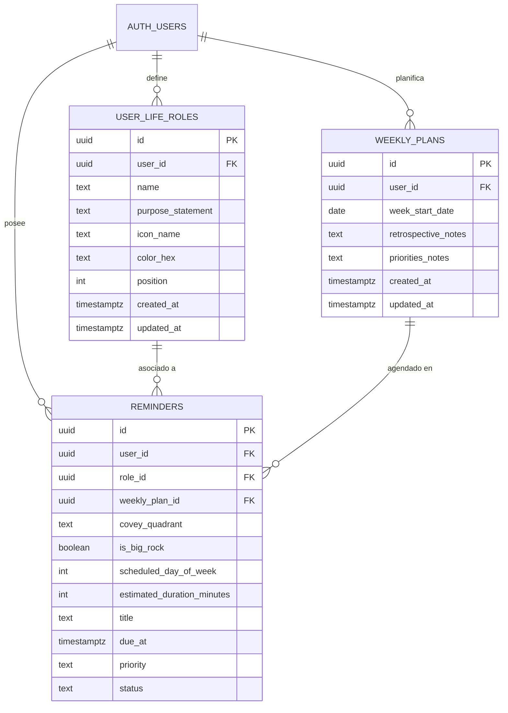
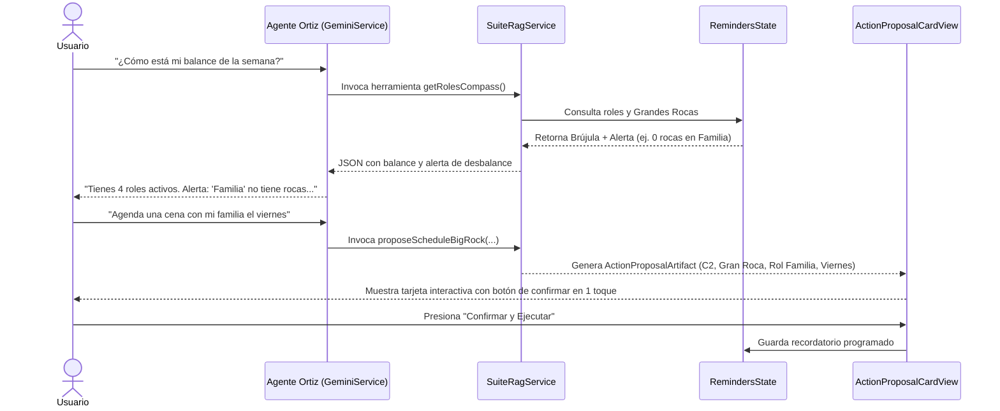

# Manual Integral del Sistema de Gestión de 4ta Generación
## Hábito 3 de Stephen R. Covey: «Primero lo Primero» (Put First Things First)
**Super-App OrtizApp / Módulo de Agenda & Recordatorios**

---

## 1. Visión Filosófica y Evolución de las Generaciones de Tiempo

El módulo de Agenda y Recordatorios está fundamentado en la teoría de gestión de tiempo y liderazgo personal desarrollada por el **Dr. Stephen R. Covey** en su obra cumbre *«Los 7 Hábitos de la Gente Altamente Efectiva»* y profundizada en *«Primero lo Primero»*.

```
   1ra Generación: Listas de Tareas y Notas
   └── "Cosas por hacer", sin estructura temporal ni prioridades.
        ▼
   2da Generación: Agendas y Calendarios
   └── Citas, reuniones y fechas límite ("el reloj"). Visión a corto plazo.
        ▼
   3ra Generación: Priorización y Gestión por Metas
   └── Matrices ABC, metas diarias. Eficiencia pero genera estrés y crisis.
        ▼
   4ta Generación: Stephen Covey (Liderazgo Centrado en Principios)
   └── "La Brújula antes que el Reloj": Preservar el equilibrio ecológico
       entre roles vitales, planificar a escala semanal y poner las
       Grandes Rocas (Cuadrante II) antes que la arena cotidiana.
```

### 1.1 Principios Fundamentales
1. **La Brújula precede al Reloj:** La velocidad a la que te mueves (el reloj) es irrelevante si la escalera está apoyada en la pared equivocada (la brújula). El sistema parte de la definición de roles y enunciados de propósito antes de asignar horas del día.
2. **Las 4 Dimensiones de Renovación Humana:** Todo ser humano posee 4 necesidades fundamentales que deben nutrirse de forma equilibrada:
   - **Física:** Salud, ejercicio, nutrición, descanso reparador.
   - **Mental:** Lectura, aprendizaje continuo, desarrollo profesional, foco profundo.
   - **Espiritual:** Meditación, conexión personal, clarificación de valores, propósito.
   - **Social / Emocional:** Relaciones significativas, familia, amistad, servicio.
3. **Regla de Oro: Ningún rol en 0:** El éxito en los negocios o estudios no compensa el colapso de la salud o la ruptura familiar. El sistema alerta proactivamente si un rol vital carece de Grandes Rocas para la semana.
4. **La Metáfora del Frasco de Cristal (Grandes Rocas vs Arena):** Si llenas la jarra de tu semana con arena y grava (urgencias ajenas, redes, notificaciones, correos triviales), no habrá espacio para las piedras grandes. Coloca las piedras grandes primero; la arena encontrará su lugar de manera natural.

---

## 2. Arquitectura de Software y Archivos del Sistema

El sistema está implementado bajo el patrón **MVVM (Model - View - ViewModel)** en Flutter:

```
quebrado-app-flutter/lib/recordatorios/
├── dialogs/
│   ├── covey_guide_dialog.dart             # Modal interactivo paso a paso (6 pasos)
│   ├── reminder_editor_dialog.dart         # Editor detallado con selector de Cuadrante, Rol y Gran Roca
│   ├── role_manager_dialog.dart            # Gestor CRUD de Roles Vitales, colores, iconos y misión
│   └── sunday_planning_wizard_dialog.dart  # Asistente de 3 pasos para el Ritual Dominical
├── models/
│   ├── covey_quadrant.dart                 # Enum C1, C2, C3, C4, labels, colores y helpers
│   ├── reminder_model.dart                 # Entidad extendida con roleId, weeklyPlanId, isBigRock, etc.
│   ├── role_model.dart                     # Modelo de Rol Vital y semillas de 4 dimensiones
│   └── weekly_plan_model.dart              # Plan semanal normalizado a lunes y notas retrospectivas
├── screens/
│   └── reminders_home_screen.dart          # Pantalla principal con selector de vistas y accesos directos
├── services/
│   ├── nlp_parser.dart                     # Extracción léxica de cuadrantes (!c1-c4), rocas (*rock*) y roles (@rol)
│   └── reminders_supabase_service.dart     # Persistencia remota en Supabase y modo fallback offline
├── theme/
│   └── reminders_colors.dart               # Tokens de color e identidad visual
├── viewmodels/
│   └── reminders_state.dart                # Estado reactivo, Drag & Drop, balance de roles y filtros
└── widgets/
    ├── covey_matrix_view.dart              # Vista Matriz 2x2 interactiva con foco C2 destacado
    └── weekly_schedule_view.dart           # Vista Agenda Semanal (7 días) + Sidebar de Brújula + Drawer
```

---

## 3. Modelo de Base de Datos y Migración SQL

Migración: `supabase/011_agenda_covey_system.sql`



### 3.1 Tablas Incorporadas
1. **`user_life_roles`**: Almacena los roles vitales definidos por el usuario, su declaración de propósito y configuración estética (icono Material y color hexadecimal).
2. **`weekly_plans`**: Registra el plan semanal. `week_start_date` siempre almacena la fecha correspondiente al **Lunes** de dicha semana, con campos para notas retrospectivas y de prioridades.
3. **Campos agregados a `reminders`**:
   - `role_id` (UUID): Vinculación al rol vital.
   - `weekly_plan_id` (UUID): Plan semanal al que pertenece la tarea.
   - `covey_quadrant` (TEXT): `'q1_urgent_important'`, `'q2_important_not_urgent'`, `'q3_urgent_not_important'`, `'q4_not_urgent_not_important'`.
   - `is_big_rock` (BOOLEAN DEFAULT FALSE): Bandera de Gran Roca semanal.
   - `scheduled_day_of_week` (INTEGER): `0` = Lunes, `1` = Martes ... `6` = Domingo, o `null` si está en la bandeja semanal no asignada.
   - `estimated_duration_minutes` (INTEGER): Duración estimada (ej. 30, 45, 60, 90 min).

---

## 4. Descripción Detallada de Características (Features)

### 4.1 Selector de Vistas Superior
En la parte superior de la pantalla principal, el usuario puede alternar instantáneamente entre tres perspectivas complementarias:
1. **📅 Agenda Semanal (Vista Predeterminada):** El marco de 4ta generación para ejecutar y proteger las Grandes Rocas día a día.
2. **⊞ Matriz 2x2:** La perspectiva estratégica para clasificar tareas por urgencia e importancia y diagnosticar el uso del tiempo.
3. **☰ Feed Clásico:** La vista tradicional de lista por vencimientos (Vencidos, Hoy, Próximos, etc.).

---

### 4.2 Agenda Semanal (Grilla de 7 Días & Drag and Drop)
Componente: `WeeklyScheduleView`

- **Grilla de Lunes a Domingo:** Presenta las 7 columnas de la semana actual. La columna correspondiente a la fecha actual (`DateTime.now()`) se resalta con fondo sutil y badge indicador.
- **Drag & Drop de Reprogramación:** Implementado mediante `Draggable<ReminderModel>` y `DragTarget<ReminderModel>`. Si surge una emergencia un martes, el usuario simplemente arrastra la tarjeta de su Gran Roca hacia el jueves. El sistema actualiza el estado optimista en milisegundos y persiste el cambio en segundo plano.
- **Bandeja Semanal Sin Asignar (Drawer Deslizable):** Un contenedor inferior que aloja las tareas capturadas durante la semana que aún no tienen día específico. Se pueden arrastrar libremente desde la bandeja hacia cualquier columna de día.
- **Distintivo Visual de Grandes Rocas:** Las tareas marcadas con `isBigRock: true` se renderizan con fondo dorado suave (`#FEF3C7`), borde ambarino (`#F59E0B`), etiqueta de Rol y una estrella ★ distintiva.

---

### 4.3 Brújula Semanal de Roles Vitales
Panel lateral (Sidebar en desktop, integrado en móvil):
- Lista todos los roles vitales activos con su icono y color temático.
- Muestra el propósito o misión de cada rol.
- Muestra un contador en tiempo real de cuántas Grandes Rocas tiene asignadas cada rol durante la semana activa.
- **Alerta de Desbalance:** Si uno o más roles tienen **0 Grandes Rocas**, se despliega una alerta ambarina destacada: *«Tienes X roles desatendidos esta semana. Recuerda que el éxito profesional no compensa el descuido personal o familiar»*.

---

### 4.4 Matriz 2x2 de Stephen Covey
Componente: `CoveyMatrixView`

Organiza las tareas en cuatro cuadrantes según los dos ejes universales: **Urgencia** e **Importancia**:

| Cuadrante | Título | Naturaleza | Estrategia Covey | Color UI |
| :--- | :--- | :--- | :--- | :--- |
| **C1** | **Crisis** | Urgente e Importante | Atender de inmediato, pero prevenir que se desborde. | Rojo (`#EF4444`) |
| **C2 ★** | **Eficacia & Liderazgo** | Importante, NO Urgente | **EL FOCO PRIMORDIAL.** Planificación, relaciones, salud, aprendizaje. | Esmeralda (`#059669`) |
| **C3** | **El Engaño** | Urgente, NO Importante | Interrupciones, pedidos imprevistos de terceros. Aprender a decir NO. | Ámbar (`#F59E0B`) |
| **C4** | **Desperdicio** | Ni Urgente ni Importante | Procrastinación, scroll vacío en redes, actividades de escape. Eliminar. | Pizarra (`#64748B`) |

- **Resalte Especial de C2:** El Cuadrante II cuenta con un borde esmeralda reforzado y una pastilla con el texto *"NÚCLEO DE EFICACIA"*.
- **Medidor de Porcentaje de Enfoque C2:** Barra de progreso superior que calcula dinámicamente:
  $$\% \text{ C2} = \left( \frac{\text{Tareas activas en C2}}{\text{Total de tareas activas}} \right) \times 100$$
  El sistema felicita al usuario cuando supera el umbral del **60%**, indicando alta efectividad proactiva.
- **Drag & Drop entre Cuadrantes:** Arrastra cualquier tarjeta de un cuadrante a otro para reclasificar su naturaleza.

---

### 4.5 El Ritual Dominical (Planificación Semanal)
Diálogo: `SundayPlanningWizardDialog`

Un asistente guiado de 3 pasos diseñado para ejecutarse en 20–30 minutos cada domingo:
1. **Paso 1: Retrospectiva & Conexión con tu Misión:**
   - Permite escribir notas sobre los logros, lecciones y dificultades de la semana que termina.
   - Presenta el enunciado de misión personal para reconectar con tus valores más profundos antes de planificar.
2. **Paso 2: Selección de Grandes Rocas por Rol:**
   - Recorre cada rol vital activo.
   - El usuario responde a la pregunta de Covey: *«¿Qué es lo ÚNICO o más importante que puedo hacer esta semana por este rol para generar el mayor impacto positivo?»*.
   - Define de 1 a 3 Grandes Rocas por rol.
   - Advierte si algún rol queda en 0.
3. **Paso 3: Agendamiento en Días de la Semana:**
   - Distribuye las rocas en los 7 días (Lunes a Domingo), asignando duración estimada y bloqueando el tiempo sagrado.

---

### 4.6 Gestor de Roles Vitales
Diálogo: `RoleManagerDialog`

Permite modelar las dimensiones de la vida del usuario:
- Crear nuevos roles o editar existentes.
- Asignar nombre (ej. *«Salud & Vitalidad»*, *«Familia & Pareja»*, *«Líder de Ingeniería»*).
- Redactar la declaración de misión o propósito del rol (ej. *«Ser un pilar de amor, escucha activa y tiempo de calidad para mis hijos»*).
- Seleccionar icono representativo (`Icons.favorite`, `Icons.fitness_center`, `Icons.school`, `Icons.spa`, etc.).
- Elegir color temático para visualización en chips y bordes.
- Incluye botón para restaurar las semillas recomendadas de las 4 dimensiones de Covey.

---

### 4.7 Modal de Guía de Organización Paso a Paso
Diálogo: `CoveyGuideDialog`

Modal interactivo accesible en cualquier momento desde:
- El botón **`¿Cómo organizarme?`** en la barra superior.
- El icono de ayuda en el AppBar.
- El botón **`¿Cómo organizarme? (Guía)`** en la Brújula Semanal.

Estructurado en 6 pasos pedagógicos con citas de Stephen Covey, ejemplos visuales de "Roca vs Arena", cheat-sheets de comandos y botones de acción directa para abrir los configuradores.

---

## 5. Sintaxis y Motor de Captura Ultrarrápida (NLP)

El motor `NlpParser` permite registrar tareas en segundos combinando modificadores Covey con lenguaje natural en español:

| Modificador | Función | Ejemplos de uso |
| :--- | :--- | :--- |
| `!c1`, `!q1` | Asigna Cuadrante I (Crisis) | `Entregar reporte de auditoría !c1` |
| `!c2`, `!q2` | Asigna Cuadrante II (Eficacia) | `Planificar estrategia del trimestre !c2` |
| `!c3`, `!q3` | Asigna Cuadrante III (Engaño) | `Llamar a soporte técnico de proveedor !c3` |
| `!c4`, `!q4` | Asigna Cuadrante IV (Desperdicio) | `Organizar archivos viejos de descargas !c4` |
| `*rock*`, `!rock`, `!piedra`, `!granroca` | Marca como Gran Roca semanal | `Entrenamiento de fuerza 1h *rock*` |
| `@NombreDelRol` | Asocia la tarea a un Rol Vital | `Cena romántica con Laura @Familia` |
| `~30m`, `~45m`, `~1h`, `~1.5h`, `~2h` | Define duración estimada | `Sesión de lectura profunda ~45m` |
| Fechas relativas | Programa fecha y hora de vencimiento | `mañana a las 8am`, `el viernes a las 3pm` |
| Tags con `#` | Categoriza con etiquetas clásicas | `#salud`, `#finanzas`, `#proyectos` |

**Ejemplo de captura integral:**
```text
Entrenar pierna y pesas en el gimnasio *rock* !c2 @Salud ~1h mañana a las 7am
```
*Resultado:* Crea una tarea en Cuadrante II, marcada como Gran Roca semanal, asignada al rol "Salud", con duración de 60 minutos, programada para el día siguiente a las 07:00.

---

## 6. Integración del Agente Ortiz (Coaching y Herramientas RAG)

El chatbot asistente inteligente (**Agente Ortiz**) actúa como un coach proactivo de Hábito 3:



### 6.1 Inyección en el Live Context Snapshot
`SuiteRagService.generateLiveContextSnapshot()` inyecta automáticamente el estado semanal en cada interacción:
```markdown
## AGENDA & HÁBITO 3 COVEY (PRIMERO LO PRIMERO)
- Semana activa: 22 de Septiembre - 28 de Septiembre 2026
- Enfoque Cuadrante II: 71.4% (Excelente enfoque en alta efectividad)
- Brújula de Roles y Grandes Rocas:
  • Salud & Vitalidad (Física): 2 Grandes Rocas (OK)
  • Profesional & Aprendiz (Mental): 3 Grandes Rocas (OK)
  • Familia & Relaciones (Social): 0 Grandes Rocas (¡ALERTA DE DESBALANCE!)
  • Individuo / Conexión (Espiritual): 1 Gran Roca (OK)
- ⚠️ ALERTA DE EQUILIBRIO: Roles desatendidos sin Grandes Rocas: Familia & Relaciones.
```

### 6.2 Herramientas Function Calling Disponibles
1. **`getWeeklySchedule`**: Devuelve la distribución de tareas por día de la semana (Lunes a Domingo) y las tareas sin asignar de la bandeja semanal.
2. **`getRolesCompass`**: Proporciona el listado de roles vitales, sus propósitos, el conteo de rocas y las alertas de desbalance.
3. **`proposeScheduleBigRock`**: Genera un artefacto de propuesta de acción interactiva (`ActionProposalCardView`) con los campos `isBigRock: true`, `quadrant: 'q2_important_not_urgent'`, `roleId`, `scheduledDayOfWeek` y `estimatedDurationMinutes`, permitiendo al usuario aprobar la programación en 1 solo clic.

---

## 7. Estrategia de Pruebas y Validación

La suite cuenta con pruebas automatizadas completas:
- **`test/covey_weekly_planner_test.dart`**:
  - Valores y labels de `CoveyQuadrant`.
  - Normalización a lunes de `WeeklyPlanModel`.
  - Semillas de 4 dimensiones de `RoleModel`.
  - Serialización de campos Covey en `ReminderModel`.
  - Detección de tokens en `NlpParser`.
  - Cálculo de roles desatendidos y mutaciones de estado (mover de día, mover de cuadrante, alternar roca).
  - Test de widget interactivo de `CoveyGuideDialog` recorriendo los 6 pasos.
- **`test/covey_agent_rag_test.dart`**:
  - Inclusión de sección Covey en `generateLiveContextSnapshot`.
  - Ejecución de `getRolesCompass`, `getWeeklySchedule` y `proposeScheduleBigRock`.
- **`test/reminders_nlp_test.dart` & `test/reminders_pinned_banner_and_sync_test.dart`**:
  - Verificación de no-regresión de fechas relativas, recurrencia RFC 5545, banner de recordatorios fijados y sincronización.

Comando para ejecutar la suite completa:
```bash
flutter test test/covey_weekly_planner_test.dart test/covey_agent_rag_test.dart test/reminders_nlp_test.dart test/reminders_pinned_banner_and_sync_test.dart test/agente_rag_test.dart
```
Resultado: **100% de pruebas aprobadas sin fallas**.
