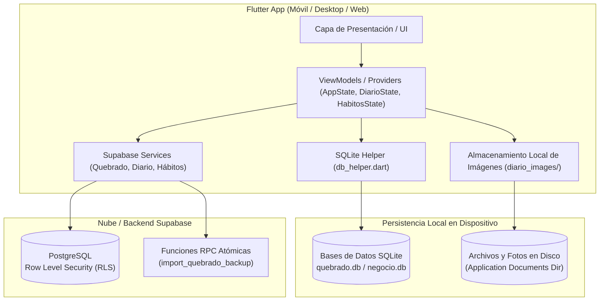
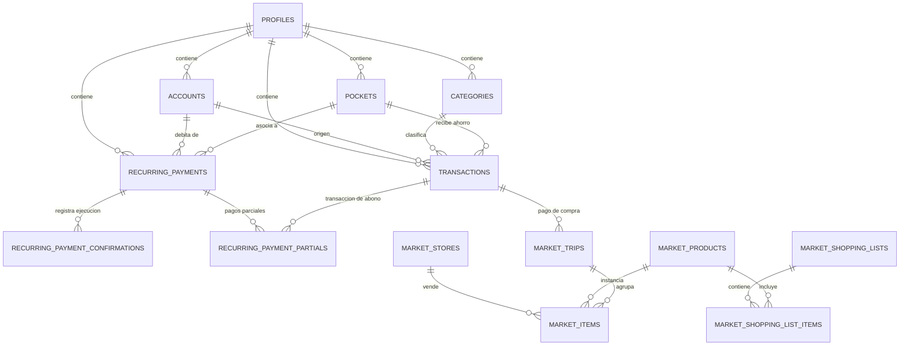
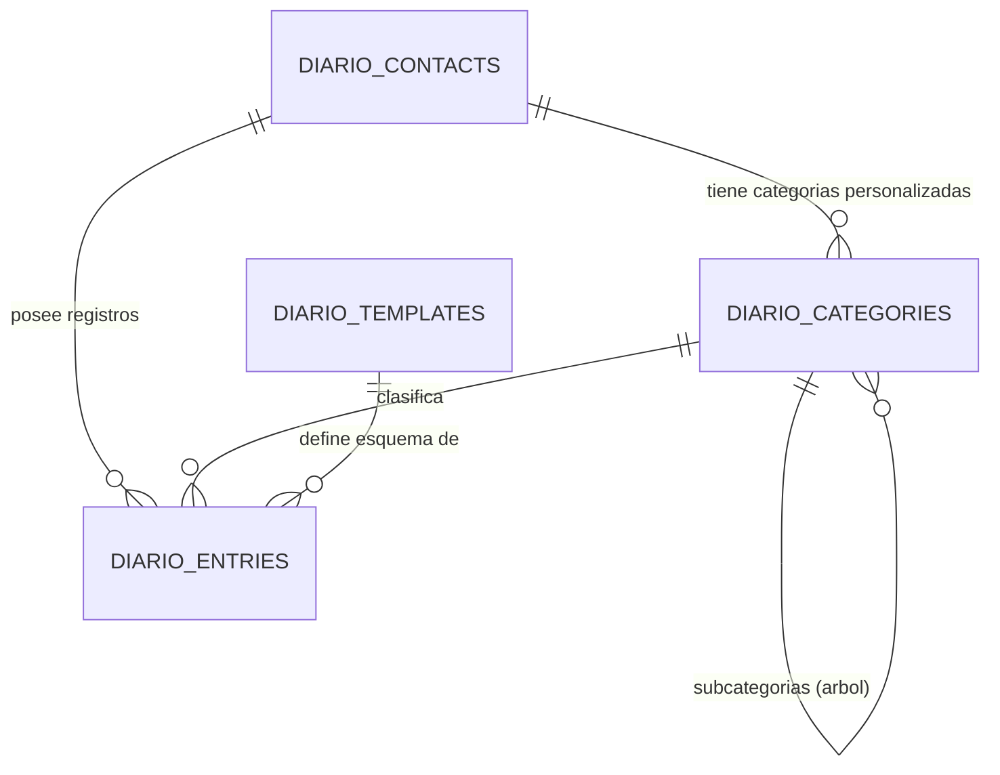
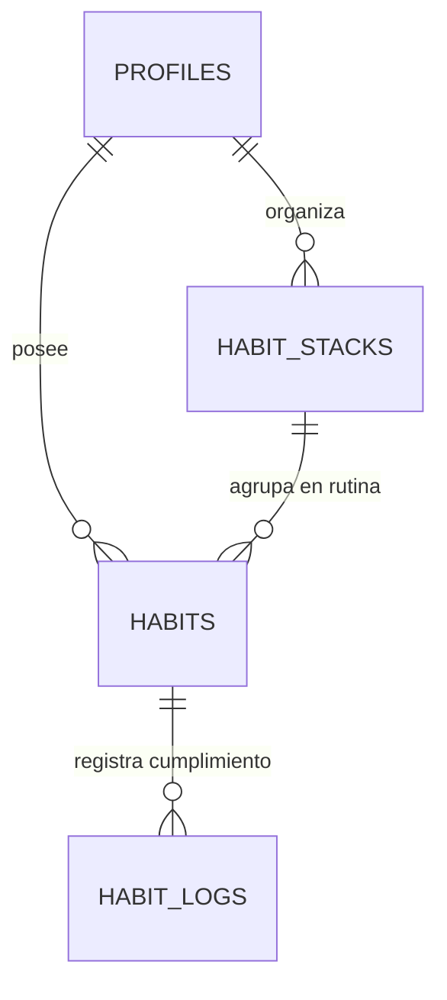
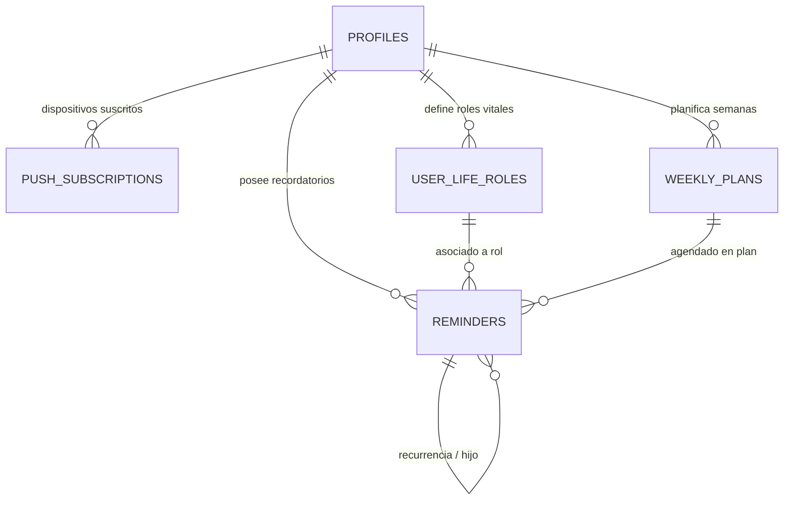

# Arquitectura de Base de Datos y Modelos - Super App OrtizApp

Este documento describe de manera exhaustiva el funcionamiento del motor de base de datos, el flujo de sincronización y cada uno de los modelos de datos de las cuatro aplicaciones que integran la suite:

1. **Quebrado:** Finanzas personales multimoneda, bolsillos de ahorro, pagos recurrentes y mercado inteligente.
2. **Diario Jottache:** Sistema de gestión de relaciones personales (PRM), categorías jerárquicas en árbol, esquemas dinámicos JSONB y registro de fotos (cámara/galería).
3. **Hábitos:** Seguimiento y forja de hábitos positivos, rotura de malos hábitos, rutinas/stacks y cálculo de rachas y métricas.
4. **Recordatorios:** Captura ultrarrápida mediante lenguaje natural (NLP), atajos de teclado globales (`Cmd/Ctrl+K`), alertas persistentes (nagging), smart snooze y sincronización en tiempo real con Supabase.

---

## 1. Arquitectura General del Sistema

La super app utiliza una **arquitectura híbrida (Offline-First + Cloud Synchronization)**:



### Principios Fundamentales:
- **Resiliencia Offline:** En Quebrado, las lecturas y escrituras se efectúan primero en **SQLite local** (`sqflite`), permitiendo una velocidad inmediata y funcionamiento sin conexión a internet.
- **Sincronización en la Nube:** Mediante **Supabase (PostgreSQL)**, las entidades cuentan con seguridad a nivel de fila (**Row Level Security - RLS**), vinculadas a `user_id UUID REFERENCES auth.users(id)`.
- **Almacenamiento Seguro de Fotos:** Las imágenes de Diario Jottache capturadas por cámara o galería se copian inmediatamente al directorio de documentos permanente de la aplicación (`diario_images/`), evitando que el sistema operativo limpie los temporales de caché. En base de datos se almacena la ruta absoluta local o la URL remota.
- **Multi-perfil Contable:** Quebrado soporta libros contables aislados (`profiles`: ej. `quebrado.db` para gastos personales y `negocio.db` para emprendimientos).

---

## 2. App 1: Quebrado (Finanzas y Mercado)

### 2.1 Diagrama Entidad-Relación (ERD)



---

### 2.2 Modelos de Quebrado

#### `Account` (Tabla: `accounts`)
Representa una billetera o cuenta bancaria física o digital.
- **`id`** (`String` / `TEXT PRIMARY KEY`): Identificador único (UUID).
- **`name`** (`String` / `TEXT NOT NULL`): Nombre de la cuenta (ej. "Banesco", "Efectivo USD", "Zinli").
- **`currency`** (`CurrencyType` / `TEXT`): Moneda de la cuenta (`usd`, `bsBCV`, `eur`).
- **`balance`** (`double` / `NUMERIC(15,2)`): Balance contable actual.
- **`colorHex`** (`String` / `TEXT`): Color identificativo en formato hexadecimal.
- **`icon`** (`String` / `TEXT`): Identificador de icono de Flutter Icons.
- **`profileId`** (`String` / `TEXT`): Libro contable al que pertenece (`quebrado.db`).
- **`createdAt` / `updatedAt`** (`DateTime` / `TIMESTAMPTZ`).

#### `Transaction` (Tabla: `transactions`)
Representa un movimiento de dinero (ingreso, egreso o compra/venta de divisas).
- **`id`** (`String` / `TEXT PRIMARY KEY`): UUID del movimiento.
- **`date`** (`DateTime` / `TIMESTAMPTZ`): Fecha y hora exacta de la transacción.
- **`amount`** (`double` / `NUMERIC(15,2)`): Monto en la moneda especificada.
- **`currency`** (`CurrencyType` / `TEXT`): Moneda (`usd`, `bsBCV`, `eur`).
- **`accountId`** (`String` / `TEXT REFERENCES accounts(id)`): Cuenta de débito o crédito.
- **`categoryId`** (`String?` / `TEXT REFERENCES categories(id)`): Categoría asignada.
- **`destinationPocketId`** (`String?` / `TEXT REFERENCES pockets(id)`): Bolsillo de ahorro asignado si fue apartado.
- **`note`** (`String` / `TEXT`): Descripción o nota adicional.
- **`type`** (`String` / `TEXT`): Tipo de transacción: `income`, `expense`, `exchange_buy`, `exchange_sell`.
- **`exchangeRate`** (`double` / `NUMERIC(15,4)`): Tasa de cambio de referencia al momento del registro.

#### `TransactionCategory` (Tabla: `categories`)
Categorías y subcategorías para clasificar gastos e ingresos.
- **`id`** (`String` / `TEXT PRIMARY KEY`): UUID.
- **`name`** (`String` / `TEXT NOT NULL`): Nombre (ej. "Alimentación", "Transporte", "Sueldo").
- **`icon`** (`String` / `TEXT`): Identificador de icono.
- **`colorHex`** (`String` / `TEXT`): Color hexadecimal.
- **`type`** (`String` / `TEXT`): `income` o `expense`.
- **`position`** (`int` / `INTEGER`): Orden de despliegue en la interfaz.
- **`parentId`** (`String?` / `TEXT REFERENCES categories(id)`): Para subcategorías jerárquicas.

#### `SavingPocket` (Tabla: `pockets`)
Bolsillos de ahorro con metas y reglas automáticas de apartado.
- **`id`** (`String` / `TEXT PRIMARY KEY`): UUID.
- **`name`** (`String` / `TEXT NOT NULL`): Nombre del objetivo (ej. "Fondo de Emergencia", "Vacaciones").
- **`currentAmountUSD`** (`double` / `NUMERIC(15,2)`): Saldo ahorrado en USD.
- **`targetAmountUSD`** (`double` / `NUMERIC(15,2)`): Meta final en USD.
- **`icon`** & **`colorHex`** (`String` / `TEXT`): Identidad visual.
- **`description`** & **`imageUrl`** (`String?` / `TEXT`): Detalles opcionales.
- **`targetDate`** (`DateTime?` / `TIMESTAMPTZ`): Fecha estimada de cumplimiento.
- **`priority`** (`int` / `INTEGER`): Nivel de prioridad (1 = baja, 2 = media, 3 = alta).
- **`fundingRuleType`** (`String` / `TEXT`): Regla de fondeo: `none`, `percentage`, `fixed_amount`, `threshold_surplus`.
- **`fundingRuleValue`** (`double?` / `NUMERIC(15,2)`): Valor de la regla (% o monto fijo).
- **`fundingRuleThreshold`** (`double?` / `NUMERIC(15,2)`): Umbral de balance mínimo en cuenta para disparar fondeo.
- **`isArchived`** (`bool` / `BOOLEAN`): Si el bolsillo está completado/archivado.

#### `RecurringPayment` (Tabla: `recurring_payments`)
Suscripciones, servicios fijos, deudas o ingresos recurrentes.
- **`id`** (`String` / `TEXT PRIMARY KEY`): UUID.
- **`name`** (`String` / `TEXT NOT NULL`): Nombre de la obligación (ej. "Alquiler", "Netflix").
- **`amount`** (`double` / `NUMERIC(15,2)`): Monto de cada pago.
- **`currency`** (`CurrencyType` / `TEXT`): Moneda.
- **`frequency`** (`String` / `TEXT`): `weekly`, `biweekly`, `fifteenDays`, `monthly`, `threeMonths`, `yearly`, `custom`, `once`.
- **`startDate`** (`DateTime` / `TIMESTAMPTZ`): Fecha inicial o de corte.
- **`type`** (`String` / `TEXT`): `expense` o `income`.
- **`accountId`** (`String` / `TEXT REFERENCES accounts(id)`): Cuenta asociada para débito.
- **`pocketId`** (`String?` / `TEXT REFERENCES pockets(id)`): Bolsillo vinculado si aplica.
- **`totalInstallments`** (`int?` / `INTEGER`): Total de cuotas (para compras a plazos o deudas finitas).
- **`customDays`** (`int?` / `INTEGER`): Intervalo en días si la frecuencia es personalizada.
- **`isVariable`** (`bool` / `BOOLEAN`): Si el monto fluctúa periódicamente (ej. electricidad).
- **`maxAmount`** (`double?` / `NUMERIC(15,2)`): Límite máximo previsto.

#### `RecurringPaymentConfirmation` (Tabla: `recurring_payment_confirmations`)
Control de ocurrencias pagadas. `id` se genera como `{recurring_payment_id}_{YYYY-MM-DD}` para asegurar idempotencia.

#### `RecurringPaymentPartial` (Tabla: `recurring_payment_partials`)
Permite registrar abonos parciales a una cuota recurrente hasta completarla.

#### `ExchangeRateRecord` (Tabla: `rate_history`)
Historial de cotizaciones de divisas (Dólar BCV, Dólar Paralelo, Euro BCV).

#### `MobilePaymentRecipient` (Tabla: `mobile_payment_recipients`)
Agenda de datos para Pago Móvil venezolano (banco, cédula, teléfono, alias).

#### Modelos de Mercado Inteligente (`market_*`)
- **`MarketStore`** (`market_stores`): Comercios y supermercados habituales.
- **`MarketProduct`** (`market_products`): Catálogo de productos con código de barras, precio de referencia en USD y unidad.
- **`MarketTrip`** (`market_trips`): Viajes o sesiones de compra activas o finalizadas.
- **`MarketItem`** (`market_items`): Ítem adquirido en un viaje con cantidad, precio en USD, precio en VES y tasa empleada.
- **`MarketShoppingList`** & **`MarketShoppingListItem`**: Listas de compras pendientes con checkbox de verificación.

---

## 3. App 2: Diario Jottache (PRM & Memoria Modular)

### 3.1 Diagrama Entidad-Relación (ERD)



---

### 3.2 Modelos de Diario Jottache

#### `DiarioContact` (Tabla: `diario_contacts`)
Representa a una persona (familiar, amigo, pareja, cliente, colega).
- **`id`** (`String` / `TEXT PRIMARY KEY`): UUID.
- **`name`** (`String` / `TEXT NOT NULL`): Nombre completo de la persona.
- **`nickname`** (`String?` / `TEXT`): Apodo o alias (ej. "Sobrini", "Mi Amor").
- **`relationship`** (`String?` / `TEXT`): Rol o parentesco (ej. "Sobrina", "Mamá", "Cliente").
- **`avatarUrl`** (`String?` / `TEXT`): Ruta de la foto de perfil en disco local o URL.
- **`avatarColor`** (`String?` / `TEXT`): Color primario de su avatar cuando no hay foto.
- **`birthdate`** (`DateTime?` / `DATE`): Fecha de cumpleaños para alertas automáticas.
- **`phone`** (`String?` / `TEXT`): Número de contacto.
- **`notes`** (`String?` / `TEXT`): Notas biográficas generales.
- **`isFavorite`** (`bool` / `BOOLEAN`): Acceso rápido en cabecera de la app.
- **`createdAt` / `updatedAt`** (`DateTime` / `TIMESTAMPTZ`).

#### `DiarioCategory` (Tabla: `diario_categories`)
Estructura de carpetas y subcarpetas jerárquicas sin límite de profundidad.
- **`id`** (`String` / `TEXT PRIMARY KEY`): UUID.
- **`contactId`** (`String?` / `TEXT REFERENCES diario_contacts(id) ON DELETE CASCADE`):
  - Si es `NULL`: Categoría global predeterminada del sistema.
  - Si tiene valor: Categoría creada exclusivamente para esa persona.
- **`parentId`** (`String?` / `TEXT REFERENCES diario_categories(id) ON DELETE CASCADE`):
  - Si es `NULL`: Categoría raíz (ej. "Alimentos", "Vehículos", "Salud").
  - Si tiene valor: Subcategoría hija (ej. "Alimentos" -> "Comidas Favoritas", "Alimentos" -> "Alergias").
- **`name`** (`String` / `TEXT NOT NULL`): Nombre de la sección.
- **`icon`** (`String` / `TEXT`): Icono identificativo.
- **`colorHex`** (`String` / `TEXT`): Color temático de la carpeta.
- **`sortOrder`** (`int` / `INTEGER`): Posición de ordenamiento.

#### `DiarioTemplate` & `DiarioFieldSchema` (Tabla: `diario_templates`)
Esquemas dinámicos reutilizables para guardar información estructurada.
- **`id`** (`String` / `TEXT PRIMARY KEY`): UUID o slug predeterminado (`tpl_automovil`, `tpl_ropa_tallas`, `tpl_alimento`, `tpl_mascota`).
- **`name`** (`String` / `TEXT NOT NULL`): Nombre de la plantilla.
- **`description`** (`String?` / `TEXT`): Descripción de uso.
- **`icon`** & **`colorHex`** (`String` / `TEXT`): Estilo visual.
- **`schema`** (`JSONB NOT NULL DEFAULT '{"fields": []}'`): Lista de campos tipados.
  - Cada campo (`DiarioFieldSchema`) define:
    - `key`: Clave identificadora (ej. `placa`, `talla_camisa`, `marca`).
    - `label`: Etiqueta visible (ej. "Placa del Vehículo").
    - `type`: Tipo de dato (`text`, `number`, `date`, `boolean`, `select`, `multiline`).
    - `required`: Booleano de obligatoriedad.
    - `placeholder`: Texto de ayuda.
    - `options`: Lista de valores para campos de selección (`select`).
- **`isSystem`** (`bool` / `BOOLEAN`): Indica si es una plantilla nativa del sistema.

#### `DiarioEntry` (Tabla: `diario_entries`)
Registros concretos almacenados dentro de un contacto y una categoría.
- **`id`** (`String` / `TEXT PRIMARY KEY`): UUID.
- **`contactId`** (`String` / `TEXT REFERENCES diario_contacts(id) ON DELETE CASCADE`).
- **`categoryId`** (`String` / `TEXT REFERENCES diario_categories(id) ON DELETE CASCADE`).
- **`templateId`** (`String?` / `TEXT REFERENCES diario_templates(id) ON DELETE SET NULL`): Enlace opcional a un modelo estructurado.
- **`entryType`** (`String` / `TEXT`): `simple_text`, `list_item`, `template_instance`.
- **`title`** (`String` / `TEXT NOT NULL`): Título del registro (ej. "Toyota Corolla 2022", "Pasta de Hígado").
- **`contentText`** (`String?` / `TEXT`): Texto largo descriptivo o notas libres.
- **`photoUrl`** (`String?` / `TEXT`): Ruta local persistente (`diario_images/...`) o URL de la fotografía adjunta.
- **`contentData`** (`Map<String, dynamic>` / `JSONB`): Almacenamiento clave-valor de los campos del esquema de plantilla. Indexado en Supabase con **GIN** para búsquedas ultra rápidas de placas, marcas, tallas, etc.
- **`isPinned`** (`bool` / `BOOLEAN`): Si la entrada aparece fijada en la parte superior.
- **`createdAt` / `updatedAt`** (`DateTime` / `TIMESTAMPTZ`).

---

## 4. App 3: Hábitos (Seguimiento, Rachas y Hábitos Negativos)

### 4.1 Diagrama Entidad-Relación (ERD)



---

### 4.2 Modelos de Hábitos

#### `HabitStackModel` (Tabla: `habit_stacks`)
Representa una rutina o grupo de hábitos estructurado por momento del día.
- **`id`** (`String` / `TEXT PRIMARY KEY`): UUID.
- **`userId`** (`String?` / `UUID REFERENCES auth.users(id)`).
- **`name`** (`String` / `TEXT NOT NULL`): Nombre de la rutina (ej. "Rutina Matutina", "Antes de Dormir").
- **`timeOfDay`** (`StackTimeOfDay` / `TEXT`): Momento del día:
  - `morning` (Mañana)
  - `afternoon` (Tarde)
  - `evening` (Noche)
  - `anytime` (Cualquier momento)
- **`icon`** (`String` / `TEXT`): Identificador de icono.
- **`position`** (`int` / `INTEGER`): Orden de la tarjeta de rutina.

#### `HabitModel` (Tabla: `habits`)
Define un hábito individual positivo o mal hábito a romper.
- **`id`** (`String` / `TEXT PRIMARY KEY`): UUID.
- **`userId`** (`String?` / `UUID REFERENCES auth.users(id)`).
- **`title`** (`String` / `TEXT NOT NULL`): Título del hábito (ej. "Tomar 2L de agua", "No fumar", "Leer 20 páginas").
- **`description`** (`String?` / `TEXT`): Explicación o motivo personal.
- **`icon`** & **`colorHex`** (`String` / `TEXT`): Identidad visual.
- **`type`** (`HabitType` / `TEXT`):
  - `binary`: Sí / No (ej. "Hacer la cama").
  - `quantitative`: Medición numérica con meta (ej. "2000 ml", "10000 pasos").
  - `timer`: Basado en tiempo (ej. "30 min de meditación").
  - `negative`: Mal hábito que se busca evitar (contador de días limpios).
- **`isNegative`** (`bool` / `BOOLEAN NOT NULL DEFAULT FALSE`): `true` para malos hábitos a romper.
- **`targetValue`** (`double` / `NUMERIC DEFAULT 1`): Valor meta diario.
- **`unit`** (`String?` / `TEXT`): Unidad de medida (`ml`, `min`, `pág`, `veces`).
- **`frequencyType`** (`HabitFrequencyType` / `TEXT`):
  - `daily`: Todos los días.
  - `weeklyTarget`: Número de días específicos por semana (ej. 4 veces por semana).
  - `customDays`: Días fijos seleccionados (ej. Lunes, Miércoles y Viernes).
- **`frequencyPayload`** (`Map<String, dynamic>` / `JSONB`): Días activos o configuración semanal.
- **`stackGroupId`** (`String?` / `TEXT REFERENCES habit_stacks(id) ON DELETE SET NULL`): Rutina a la que pertenece.
- **`archived`** (`bool` / `BOOLEAN DEFAULT FALSE`): Si el hábito está pausado o archivado.
- **`position`** (`int` / `INTEGER`): Orden dentro de su grupo.

#### `HabitLogModel` (Tabla: `habit_logs`)
Registro de cumplimiento por día.
- **`id`** (`String` / `TEXT PRIMARY KEY`): UUID.
- **`habitId`** (`String` / `TEXT REFERENCES habits(id) ON DELETE CASCADE`).
- **`userId`** (`String?` / `UUID REFERENCES auth.users(id)`).
- **`logDate`** (`DateTime` / `DATE NOT NULL`): Fecha en formato `YYYY-MM-DD`.
- **`value`** (`double` / `NUMERIC DEFAULT 1`): Progreso numérico acumulado en esa fecha.
- **`completed`** (`bool` / `BOOLEAN NOT NULL DEFAULT FALSE`): Si la meta fue alcanzada o el día se mantuvo limpio (para negativos).
- **`notes`** (`String?` / `TEXT`): Reflexión o diario del día.
- **Restricción de unicidad:** `CONSTRAINT unique_habit_per_day UNIQUE (habit_id, log_date)` garantizando que nunca existan registros duplicados en el mismo día para un hábito.

---

## 5. App 4: Recordatorios (Reminders, NLP & Smart Snooze)

### 5.1 Diagrama Entidad-Relación (ERD)



---

### 5.2 Modelos de Recordatorios & Agenda de 4ta Generación

#### `RoleModel` (Tabla: `user_life_roles`)
Define las dimensiones fundamentales de la vida del usuario (Salud, Familia, Profesional, Espiritual, etc.) según el Hábito 3 de Stephen Covey.
- **`id`** (`String` / `UUID PRIMARY KEY`): Identificador único.
- **`userId`** (`String?` / `UUID REFERENCES auth.users(id)`).
- **`name`** (`String` / `TEXT NOT NULL`): Nombre del rol vital.
- **`purposeStatement`** (`String?` / `TEXT`): Declaración de misión o propósito de vida para este rol.
- **`iconName`** (`String` / `TEXT DEFAULT 'star'`): Identificador del icono Material.
- **`colorHex`** (`String` / `TEXT DEFAULT '#3B82F6'`): Color distintivo del rol en formato hexadecimal.
- **`position`** (`int` / `INTEGER DEFAULT 0`): Posición ordinal de ordenamiento en la brújula.
- **`createdAt` / `updatedAt`** (`DateTime` / `TIMESTAMPTZ`).

#### `WeeklyPlanModel` (Tabla: `weekly_plans`)
Controla el ciclo semanal de planificación y balance vital.
- **`id`** (`String` / `UUID PRIMARY KEY`).
- **`userId`** (`String?` / `UUID REFERENCES auth.users(id)`).
- **`weekStartDate`** (`DateTime` / `DATE NOT NULL`): Fecha correspondiente al **Lunes** de inicio de la semana.
- **`retrospectiveNotes`** (`String?` / `TEXT`): Notas de evaluación, logros y aprendizajes de la semana previa.
- **`prioritiesNotes`** (`String?` / `TEXT`): Notas de prioridades y compromisos de la semana actual.
- **`createdAt` / `updatedAt`** (`DateTime` / `TIMESTAMPTZ`).

#### `ReminderModel` (Tabla: `reminders`)
Entidad principal para la captura y programación de tareas personales, enriquecida con los atributos de 4ta generación (Covey):
- **`id`** (`String` / `UUID PRIMARY KEY`): Identificador único.
- **`userId`** (`String?` / `UUID REFERENCES auth.users(id)`).
- **`roleId`** (`String?` / `UUID REFERENCES public.user_life_roles(id)`): Rol vital al que pertenece la tarea.
- **`weeklyPlanId`** (`String?` / `UUID REFERENCES public.weekly_plans(id)`): Plan semanal asignado.
- **`coveyQuadrant`** (`CoveyQuadrant` / `TEXT DEFAULT 'q2_important_not_urgent'`):
  - `'q1_urgent_important'`: C1 Crisis (Urgente e Importante)
  - `'q2_important_not_urgent'`: C2 Eficacia & Liderazgo (Importante, NO Urgente, ⭐ foco >60%)
  - `'q3_urgent_not_important'`: C3 El Engaño (Urgente, NO Importante)
  - `'q4_not_urgent_not_important'`: C4 Desperdicio (Ni Urgente ni Importante)
- **`isBigRock`** (`bool` / `BOOLEAN DEFAULT FALSE`): Bandera de Gran Roca semanal no negociable.
- **`scheduledDayOfWeek`** (`int?` / `INTEGER`): Día asignado en la agenda semanal (0 = Lunes, 1 = Martes ... 6 = Domingo; `null` = Bandeja semanal no asignada).
- **`estimatedDurationMinutes`** (`int?` / `INTEGER`): Estimación de duración en minutos (ej. 30, 45, 60 min).
- **`isPinned`** (`bool` / `BOOLEAN DEFAULT FALSE`): Fijado en el banner global superior.
- **`title`** (`String` / `TEXT NOT NULL`): Título limpio de la tarea.
- **`notes`** (`String?` / `TEXT`): Detalles adicionales o notas de apoyo.
- **`priority`** (`ReminderPriority` / `reminder_priority`): `p1_urgent`, `p2_high`, `p3_medium`, `p4_low`.
- **`status`** (`ReminderStatus` / `reminder_status`): `pending`, `completed`, `snoozed`, `archived`.
- **`dueAt`** (`DateTime?` / `TIMESTAMPTZ`): Momento exacto de vencimiento.
- **`clientTimezone`** (`String` / `TEXT DEFAULT 'UTC'`).
- **`rrule`** (`String?` / `TEXT`): Regla de recurrencia estándar RFC 5545 iCalendar.
- **`parentId`** (`String?` / `UUID REFERENCES public.reminders(id)`): Para instancias generadas de tareas recurrentes.
- **`isNagging`** (`bool` / `BOOLEAN DEFAULT FALSE`): Alertas persistentes re-notificables.
- **`nagIntervalMinutes`** (`int` / `INTEGER DEFAULT 10`).
- **`lastNotifiedAt`** (`DateTime?` / `TIMESTAMPTZ`).
- **`tags`** (`List<String>` / `TEXT[] DEFAULT ARRAY[]::TEXT[]`).
- **`completedAt`** (`DateTime?` / `TIMESTAMPTZ`).
- **`createdAt` / `updatedAt`** (`DateTime` / `TIMESTAMPTZ`).

#### `PushSubscription` (Tabla: `push_subscriptions`)
Suscripciones Web Push y móviles vinculadas al perfil de usuario para recepción de alertas remotas mediante Edge Functions y el protocolo VAPID.
- **`id`** (`String` / `UUID PRIMARY KEY`).
- **`userId`** (`String` / `UUID REFERENCES auth.users(id)`).
- **`endpoint`** (`String` / `TEXT UNIQUE NOT NULL`).
- **`p256dh`** & **`auth`** (`String` / `TEXT NOT NULL`): Claves criptográficas de entrega push.
- **`userAgent`** (`String?` / `TEXT`).
- **`createdAt`** (`DateTime` / `TIMESTAMPTZ`).

---

## 6. Estrategia de Sincronización, Respaldos y Migraciones

### 5.1 Respaldos Locales JSON (`BackupService`)
Quebrado cuenta con un motor de respaldo completo en formato JSON (`copia_seguridad_quebrado_...json`), el cual serializa todas las tablas SQLite en un único documento para exportación o restauración local directa.

### 5.2 Restauración Atómica en Supabase vía RPC (`import_quebrado_backup`)
Para sincronizar un respaldo local completo hacia la nube sin inconsistencias ni errores de claves foráneas, se implementó el procedimiento almacenado en PostgreSQL:
```sql
CREATE OR REPLACE FUNCTION import_quebrado_backup(
    p_backup_json JSONB,
    p_user_id UUID DEFAULT NULL
) RETURNS JSONB;
```
Este script limpia ordenadamente las tablas dependientes en cascada y reinserta:
1. `profiles`
2. `accounts`
3. `pockets`
4. `categories`
5. `transactions`
6. `rate_history`
7. `recurring_payments` y sus confirmaciones
8. `market_stores`, `market_products`, `market_trips`, `market_items`, `market_shopping_lists`

### 5.3 Índices de Rendimiento Globales
- **Índices GIN:** Aplicados sobre columnas `JSONB` (`diario_entries.content_data`) para posibilitar búsquedas instantáneas sobre campos dinámicos sin importar cuántos atributos cree el usuario.
- **Índices Compuestos:** `(habit_id, log_date)` en `habit_logs` e `(account_id, date DESC)` en `transactions` para optimizar consultas de timeline y rachas cronológicas.
