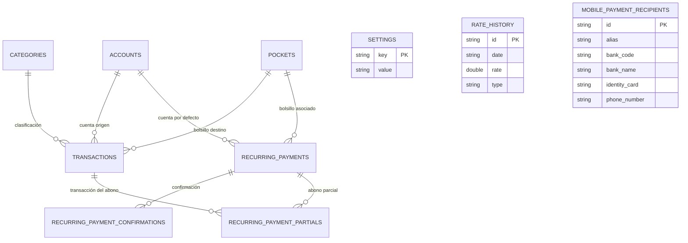

# Documentación Técnica - Quebrado App (Flutter)

Este documento proporciona una guía detallada, técnica y algorítmica sobre la arquitectura, base de datos, lógica de estado y flujos clave de la aplicación **Quebrado App**. El propósito de esta guía es servir como punto de partida y referencia para futuros desarrollos y mantenimiento del sistema.

---

## 1. Arquitectura General y Stack Tecnológico

La aplicación está construida sobre el framework **Flutter** usando el lenguaje **Dart**. Adopta el patrón de arquitectura **MVVM (Model-View-ViewModel)** combinado con inyección de dependencias y reactividad provista por el paquete `provider`.

### Stack Tecnológico Principal:
*   **Gestión de Estado**: `provider` (reactivo, centralizado en `AppState`).
*   **Persistencia Local**: `sqflite` (base de datos relacional SQLite).
*   **Visualización de Datos**: `fl_chart` (para gráficos interactivos de evolución e históricos).
*   **Seguridad**: `local_auth` (autenticación biométrica con huella dactilar/FaceID).
*   **Compartición y Archivos**: `share_plus`, `file_picker` y `excel` (para copias de seguridad e informes).

---

## 2. Esquema de Base de Datos (SQLite - `db_helper.dart`)

La base de datos contiene **10 tablas** principales con restricciones de clave foránea activas (`PRAGMA foreign_keys = ON`) para asegurar la integridad referencial a través de cascadas (`ON DELETE CASCADE`) y anulaciones (`ON DELETE SET NULL`).



### Detalle de las Tablas:

1.  **`settings`**: Parámetros globales de configuración en formato clave-valor.
    *   `key` (TEXT PRIMARY KEY)
    *   `value` (TEXT)
    *   *Claves conocidas*: `bcvRate` (tasa oficial BCV), `paraleloRate` (tasa paralela), `euroRate` (tasa del euro), `primaryCurrency` (moneda base de visualización), `useBiometrics` (toggle de biometría), `useSlideToConfirm` (toggle de deslizador).
2.  **`accounts`**: Cuentas físicas o bancarias con saldos reales.
    *   `id` (TEXT PRIMARY KEY)
    *   `name` (TEXT)
    *   `currency` (TEXT - `usd` o `bsBCV`)
    *   `balance` (REAL)
    *   `color_hex` (TEXT)
    *   `icon` (TEXT)
3.  **`pockets`**: Metas de ahorro destinadas a apartar fondos líquidos.
    *   `id` (TEXT PRIMARY KEY)
    *   `name` (TEXT)
    *   `current_amount_usd` (REAL)
    *   `target_amount_usd` (REAL)
    *   `icon` (TEXT)
    *   `color_hex` (TEXT)
    *   `description` (TEXT, Nullable)
    *   `image_url` (TEXT, Nullable)
    *   `target_date` (TEXT, Nullable)
    *   `priority` (INTEGER DEFAULT 1 - Donde 1 es la mayor prioridad)
4.  **`categories`**: Clasificadores para transacciones e históricos.
    *   `id` (TEXT PRIMARY KEY)
    *   `name` (TEXT)
    *   `icon` (TEXT)
    *   `color_hex` (TEXT)
    *   `type` (TEXT - `income` o `expense`)
    *   `position` (INTEGER DEFAULT 0 - Para ordenamiento drag-and-drop)
5.  **`transactions`**: Historial consolidado de movimientos financieros.
    *   `id` (TEXT PRIMARY KEY)
    *   `date` (TEXT - formato ISO 8601)
    *   `amount` (REAL)
    *   `currency` (TEXT - `usd` o `bsBCV`)
    *   `destination_pocket_id` (TEXT Nullable - Clave foránea a `pockets` ON DELETE SET NULL)
    *   `category_id` (TEXT Nullable - Clave foránea a `categories` ON DELETE SET NULL)
    *   `account_id` (TEXT Nullable - Clave foránea a `accounts` ON DELETE CASCADE)
    *   `note` (TEXT)
    *   `type` (TEXT - `income`, `expense`, `exchange_buy`, `exchange_sell`)
    *   `exchange_rate` (REAL - Tasa de cambio aplicada al momento del registro)
6.  **`recurring_payments`**: Parámetros de suscripciones o gastos fijos periódicos.
    *   `id` (TEXT PRIMARY KEY)
    *   `name` (TEXT)
    *   `amount` (REAL)
    *   `currency` (TEXT - `usd` o `bsBCV`)
    *   `frequency` (TEXT - `weekly`, `biweekly`, `fifteenDays`, `monthly`, `threeMonths`, `yearly`, `custom`, `once`)
    *   `start_date` (TEXT)
    *   `notification_option` (TEXT)
    *   `icon` (TEXT)
    *   `color_hex` (TEXT)
    *   `type` (TEXT - `income` o `expense`)
    *   `account_id` (TEXT Nullable - Clave foránea a `accounts` ON DELETE CASCADE)
    *   `pocket_id` (TEXT Nullable - Clave foránea a `pockets` ON DELETE SET NULL)
    *   `total_installments` (INTEGER Nullable - Límite de cuotas)
    *   `custom_days` (INTEGER Nullable - Frecuencia de días para el modo personalizado)
    *   `is_variable` (INTEGER DEFAULT 0 - Booleano para definir si el cobro es variable)
    *   `max_amount` (REAL Nullable - Límite superior de cobro variable)
7.  **`recurring_payment_confirmations`**: Fechas de cobros ya concretados y registrados.
    *   `id` (TEXT PRIMARY KEY - compuesto por `recurring_payment_id + "_" + dateStr`)
    *   `recurring_payment_id` (TEXT - Clave foránea a `recurring_payments` ON DELETE CASCADE)
    *   `date` (TEXT - formato `YYYY-MM-DD`)
8.  **`recurring_payment_partials`**: Abonos previos aplicados a una ocurrencia futura.
    *   `id` (TEXT PRIMARY KEY)
    *   `recurring_payment_id` (TEXT - Clave foránea a `recurring_payments` ON DELETE CASCADE)
    *   `occurrence_date` (TEXT - fecha de la cuota programada a abonar)
    *   `amount` (REAL)
    *   `transaction_id` (TEXT - Clave foránea a `transactions` ON DELETE CASCADE)
9.  **`rate_history`**: Registro diario de tasas cargadas para estimaciones estadísticas.
    *   `id` (TEXT PRIMARY KEY)
    *   `date` (TEXT)
    *   `rate` (REAL)
    *   `type` (TEXT - `bcv` o `paralelo`)
10. **`mobile_payment_recipients`**: Agenda de destinatarios para Pago Móvil.
    *   `id` (TEXT PRIMARY KEY)
    *   `alias` (TEXT)
    *   `bank_code` (TEXT)
    *   `bank_name` (TEXT)
    *   `identity_card` (TEXT)
    *   `phone_number` (TEXT)

---

## 3. Gestor de Estado Global (`AppState`)

El `AppState` en `lib/viewmodels/app_state.dart` centraliza la carga de datos desde SQLite hacia colecciones de memoria y expone propiedades reactivas (`notifyListeners()`).

### Ciclo de Carga (`loadData`):
1.  Consulta la tabla `settings` para inicializar tasas (`bcvRate`, `parallelRate`, `euroRate`) y preferencias de seguridad.
2.  Trae listas de cuentas, bolsillos, categorías, beneficiarios y transacciones ordenadas.
3.  Carga de forma optimizada los identificadores confirmados de cobros recurrentes (`_confirmedKeys`) y abonos parciales.
4.  Ejecuta `updatePendingPaymentsToday()` para calcular qué eventos recurrentes se han vencido hasta el día de hoy y necesitan atención del usuario.

### Propiedades Reactivas Calculadas:
*   `totalBalanceUSD`: Suma de balances de cuentas físicas convertidas a USD.
*   `totalPocketsUSD`: Suma del saldo actual de todos los bolsillos de ahorro.
*   `liquidBalanceUSD`: Dinero en cuentas físicas libre de asignaciones de ahorro:
    $$\text{liquidBalanceUSD} = \text{totalBalanceUSD} - \text{totalPocketsUSD}$$

---

## 4. Algoritmos y Fórmulas Matemáticas Clave

### A. Dinero Seguro (Safe to Save)
El **Dinero Seguro** es el saldo líquido más bajo proyectado en el transcurso de la simulación del Timeline a 365 días. Proteger este saldo garantiza matemáticamente que ninguna transacción programada (como cuotas o servicios) dejará al usuario en saldo negativo en fechas futuras.

#### Lógica:
1.  Se generan todos los eventos del Timeline (`getTimelineEvents(365)`), los cuales simulan cronológicamente ingresos recurrentes, gastos recurrentes pendientes y provisiones programadas de bolsillos.
2.  En cada evento $i$, se evalúa el saldo líquido consolidado proyectado:
    $$\text{projectedLiquid}_i = \text{projectedUSD}_i - \text{projectedPocketBalances}_i$$
3.  Se busca el valor mínimo resultante:
    $$\text{safeToSaveAmountUSD} = \min_{i} (\text{projectedLiquid}_i, \text{liquidBalanceUSD}_{\text{actual}})$$
4.  Si el valor mínimo ocurre hoy, el usuario no tiene restricciones. Si ocurre en una fecha futura, ese mínimo es el límite máximo de gasto libre actual.

### B. Meta Diaria de Ventas/Trabajo (Sales/Work Goal)
Si en la simulación del Timeline a 1 año el saldo líquido proyectado cae por debajo de cero en algún punto, se calcula una meta diaria de ingresos adicionales para salir del déficit a tiempo.

```
+-------------------------------------------------------+
|  1. Identificar déficit de fondos proyectado (Min)    |
+-------------------------------------------------------+
                           |
                           v
+-------------------------------------------------------+
|  2. Calcular días restantes hasta la fecha del Min    |
+-------------------------------------------------------+
                           |
                           v
+-------------------------------------------------------+
|  3. Extra Diario = |Déficit| / Días Restantes         |
+-------------------------------------------------------+
                           |
                           v
+-------------------------------------------------------+
|  4. Meta Total = Mínimo habitual diario + Extra       |
+-------------------------------------------------------+
```

#### Fórmulas:
*   $\text{Déficit} = -(\text{safeToSaveAmountUSD})$ (donde $\text{safeToSaveAmountUSD} < 0$)
*   $\text{Días para el Faltante} = \text{Fecha del Faltante} - \text{Fecha Actual}$ (mínimo 1 día)
*   $\text{Ingreso Diario Requerido Extra} = \frac{\text{Déficit}}{\text{Días para el Faltante}}$
*   $\text{Meta Diaria Total Recomendada} = \text{Ingreso Diario Fijo Base} + \text{Ingreso Diario Requerido Extra}$

### C. Predicción Cambiaria (BCV Linear Regression)
En `bcv_predictor.dart`, el sistema estima la tendencia de la tasa del dólar oficial BCV mediante una regresión lineal sobre un historial de hasta 15 días hábiles.

#### 1. Retorno Porcentual Diario:
$$R_t = \frac{\text{Tasa}_t - \text{Tasa}_{t-1}}{\text{Tasa}_{t-1}}$$

#### 2. Crecimiento Ponderado (Weighted Growth Rate):
Para dar mayor relevancia a las variaciones recientes, se asigna un peso lineal incremental a los retornos:
$$\text{WeightedGrowthRate} = \frac{\sum_{i=1}^{k} i \cdot R_{m - k + i}}{\sum_{i=1}^{k} i}$$
*Donde $k$ es el tamaño de la ventana activa (máximo 15 deltas) y $m$ es la longitud total del vector de retornos.*

#### 3. Volatilidad Diaria:
Desviación estándar de los retornos porcentuales diarios en la ventana analizada:
$$\sigma = \sqrt{\frac{1}{k} \sum_{i=m-k}^{m-1} (R_i - \bar{R})^2}$$

#### 4. Proyecciones a Futuro:
*   **Predicción Mañana**: $\text{Tasa}_{\text{actual}} \cdot (1 + \text{WeightedGrowthRate})$
*   **Predicción 7 días**: $\text{Tasa}_{\text{actual}} \cdot (1 + \text{WeightedGrowthRate})^7$
*   **Predicción 14 días**: $\text{Tasa}_{\text{actual}} \cdot (1 + \text{WeightedGrowthRate})^{14}$

#### 5. Coeficiente de Determinación ($R^2$):
Mide la consistencia lineal de la tendencia histórica de precios ($y$) contra un índice temporal ($x$):
$$R^2 = 1 - \frac{SS_{\text{res}}}{SS_{\text{tot}}} = 1 - \frac{\sum (y_i - \hat{y}_i)^2}{\sum (y_i - \bar{y})^2}$$
*Donde $\hat{y}_i = a x_i + b$ son las tasas estimadas por la recta de mínimos cuadrados.*

### D. Asignaciones Proactivas de Bolsillo
El simulador genera automáticamente sugerencias de aprovisionamiento en la proyección:

1.  **Potencial de Ahorro Diario (Daily Saving Potential - DSP)**:
    $$\text{DSP} = \text{Ingresos Diarios Equivalentes} - \text{Gastos Diarios Equivalentes}$$
2.  **Distribución de Fondos por Prioridades**:
    *   Si $\text{DSP} > 0$, el dinero disponible se distribuye entre los bolsillos activos que aún no han alcanzado su meta.
    *   Se agrupan por nivel de prioridad (1 es el más prioritario).
    *   Para cada bolsillo $p$ en el nivel actual, se calcula la tasa diaria necesaria para llegar a la meta en su fecha límite:
        $$\text{Tasa Requerida}_p = \frac{\text{Meta}_p - \text{Ahorro Actual}_p}{\text{Días Restantes}_p}$$
    *   Si la suma de tasas requeridas en el nivel es menor o igual al $\text{DSP}$ restante, se asigna la tasa completa a cada bolsillo y se resta el total del $\text{DSP}$.
    *   Si el $\text{DSP}$ restante no es suficiente para cubrir el nivel actual, se reparte proporcionalmente a la tasa requerida de cada uno y se detiene el reparto para niveles inferiores.

---

## 5. Políticas y Validaciones Críticas de Negocio

### A. Datos del Contacto Obligatorios para Pago Móvil
Cuando se registra o edita un gasto en `add_transaction_dialog.dart` y se marca la opción de **Pago Móvil** como activa, se deben cumplir obligatoriamente las siguientes condiciones de contacto:
*   **Nombre o Alias del receptor**: No puede estar vacío.
*   **Cédula / RIF**: No puede estar vacío.
*   **Número de Teléfono**: No puede estar vacío y debe poseer una longitud mínima de **10 caracteres/dígitos** para considerarse un formato móvil válido en Venezuela.
*   *Control de errores*: Si falla alguna validación, se interrumpe el flujo de guardado y se muestra un SnackBar explicativo al usuario.

### B. Confirmación de Transacciones desde Detalles de la Línea de Tiempo
En el historial de la línea de tiempo (`timeline_event_row.dart`), el botón para confirmar o marcar como completado un cobro/pago pendiente pasa por el siguiente pipeline de validación:
1.  **Autenticación**:
    *   Si `useSlideToConfirm` está activo en los ajustes de usuario, el botón cambia de forma y requiere un gesto de deslizamiento completo (`SlideToConfirmButton`).
    *   Si `useBiometrics` está activo, se dispara la autenticación biométrica de `local_auth`. Si el usuario no se valida con éxito, se cancela el proceso arrojando una alerta.
2.  **Validación de Fondos y Flujo de Registro**:
    *   **Caso con fondos suficientes**: Si el balance actual de la cuenta a debitar puede cubrir el monto del gasto recurrente (sin causar déficit inmediato), la transacción se registra directamente en segundo plano y los balances locales se recalculan al instante.
    *   **Caso con déficit de fondos**: Si el débito proyectado arroja saldo negativo, se abre la hoja consolidada de confirmaciones (`PendingConfirmationsBottomSheet`) para guiar al usuario a seleccionar de qué cuenta transferir fondos, cubrir el balance restante o aplicar abonos parciales.

### C. Multi-Select y Presupuesto en Cambio de Divisas
En la hoja `ExchangePaymentOptionsBottomSheet` de `add_exchange_dialog.dart`, la venta de divisas ($ \rightarrow $ Bs.) permite seleccionar múltiples gastos recurrentes en VES usando el dinero recién vendido:
*   Muestra el saldo VES total proveniente del intercambio.
*   Al marcar o desmarcar gastos en la lista con checkboxes, se calcula dinámicamente el presupuesto disponible restante.
*   Cualquier gasto cuyo costo total supere el presupuesto restante en bolívares se **deshabilita** automáticamente (se reduce su opacidad y se bloquea el tap/checkbox).
*   Si no se selecciona ningún gasto recurrente para pagar con los bolívares resultantes, el botón muestra **"Omitir"** (y solo registra la venta de divisas). Si se selecciona al menos uno, el botón pasa a decir **"Pagar"**, confirmando en secuencia asíncrona todos los cobros programados que hayan sido seleccionados.

---

## 6. Estructura del Código Fuente y Carpetas

El directorio principal de desarrollo es `/lib`:

*   `/models`: Contiene las clases de datos y conversores `fromMap`/`toMap`.
    *   `account.dart`
    *   `currency_type.dart`
    *   `saving_pocket.dart`
    *   `transaction.dart`
    *   `recurring_payment.dart`
    *   `mobile_payment_recipient.dart`
*   `/viewmodels`: Lógica de negocios y estado global.
    *   `app_state.dart`
*   `/services`: Clases utilitarias y de infraestructura de bajo nivel.
    *   `db_helper.dart` (SQLite CRUD, esquemas, migraciones).
    *   `bcv_predictor.dart` (Estadísticas y regresiones lineales).
    *   `biometric_service.dart` (Interfaz de hardware biométrico).
    *   `notification_manager.dart` (Gestión de alarmas e hilos locales).
    *   `backup_service.dart` (Serialización JSON e importaciones seguras).
*   `/dialogs`: Modales y hojas flotantes inferiores (Bottom Sheets) para entradas del usuario.
    *   `add_transaction_dialog.dart` (Registros de transacciones y Pago Móvil).
    *   `add_exchange_dialog.dart` (Intercambio multi-select).
    *   `pending_confirmations_dialog.dart` (Consolidador de cobros pendientes).
*   `/screens`: Vistas principales asociadas a la barra de navegación del menú.
    *   `dashboard_screen.dart`
    *   `timeline_screen.dart`
    *   `pockets_screen.dart`
    *   `settings_screen.dart`
*   `/widgets`: Componentes UI reutilizables.
    *   `slide_to_confirm_button.dart`
    *   `claymorphic_card.dart`
    *   `timeline_event_row.dart`

---

## 7. Advertencias y Consideraciones para Desarrolladores (Gotchas)

> [!WARNING]
> **Integridad de Migraciones en SQLite:**
> Al agregar columnas o alterar tablas en `db_helper.dart`, asegúrate de actualizar la versión de la base de datos en `_initDB` y escribir la migración correspondiente en el método `_onUpgrade` de forma defensiva empleando bloques `try-catch` para evitar fallos si las columnas ya existen en bases de datos de producción locales.

> [!IMPORTANT]
> **C gaps y context.mounted:**
> Dado que gran parte de los diálogos realizan llamadas asíncronas consecutivas de almacenamiento y biometría, verifica siempre `if (!context.mounted) return;` antes de llamar a Navigator, snackbars o diálogos de éxito para prevenir cuelgues o fugas de memoria en la interfaz gráfica.

> [!NOTE]
> **Inicialización en Pruebas Unitarias:**
> sqflite no está soportado de forma nativa en entornos de pruebas unitarias locales en PC sin inicializar un factory virtual. Si creas tests que invoquen almacenamiento, asegúrate de inicializar `databaseFactory = databaseFactoryFfi` al inicio de cada archivo de prueba o emplear mocks de `AppState`.
